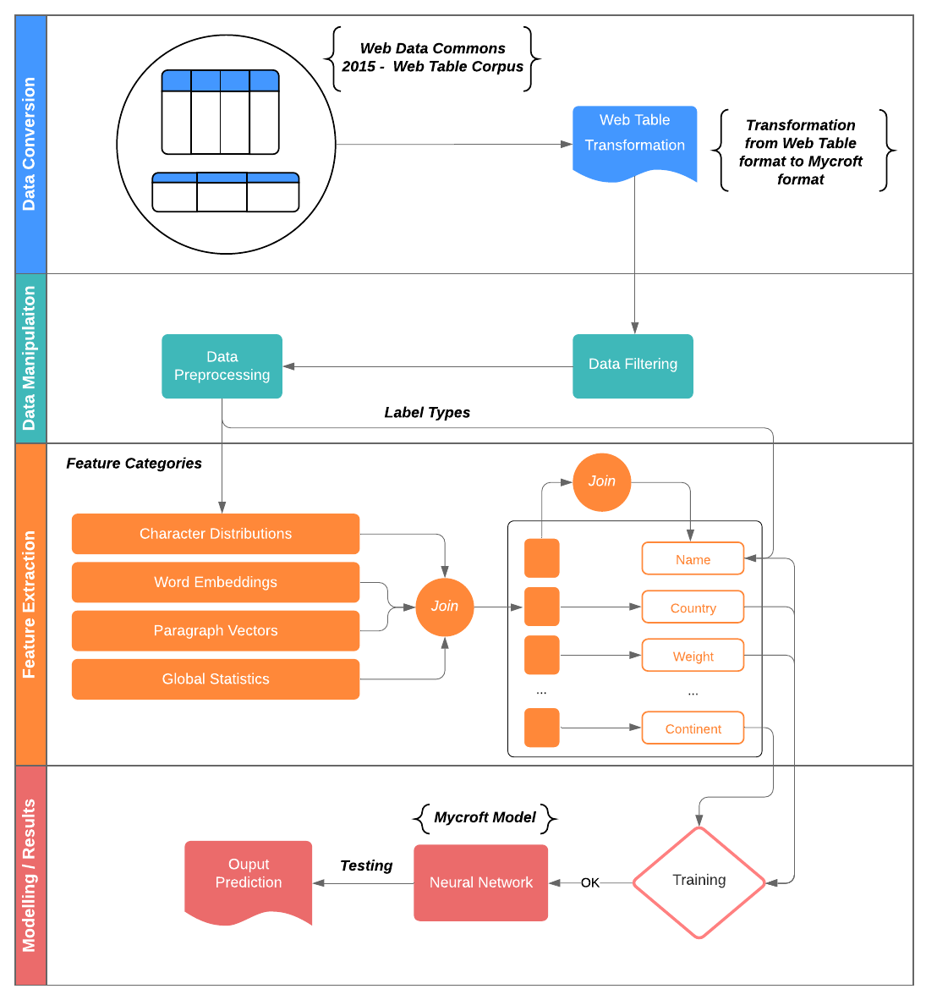
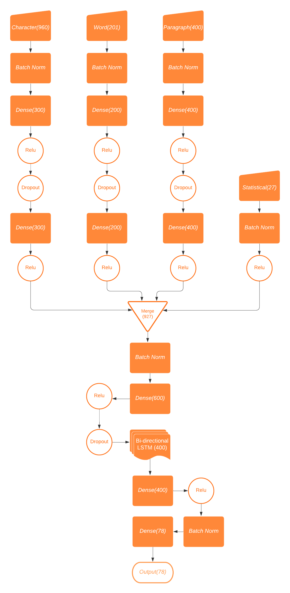

# Mycroft

An AI approach to detect Semantic Data Types using NLP and Deep Learning.


## Installation Steps

1) Install python. Make sure you are using python version 3.7 or above.

2) Once the repository is cloned, go to project's folder and create a virtual environment using environment manager like **virtualenv**, **conda**, **pipenv**.

3) Activate the environment and install the desired python packages using:

    ```
     pip install -r requirements.txt
    ```

4) Now the main dataset is extracted from the website http://data.dws.informatik.uni-mannheim.de/webtables/2015-07/englishCorpus/compressed/ .
 Once you go to the website download the first folder and extract the folder which will be called `0` and place it in the directory named `resources/data`.

## Code Execution

There are 2 parts to the code, the data conversion part and the complete process execution part.

1. *Data Conversion*: 

   - After the packages and the dataset is installed and structured, lets look at the data conversion part, it consists of command line arguments to run the codes in a specific ways. The command line arguments are:

     - `--sample` or `-s`, default=False, description=Choose if you want to use sample or not
     - `--no_of_tables` or `-num`, default=False, description=Choose the number of tables that are needed for Mycroft

     Using the above command line arguments, we can run the code using the following commands after going to the `src/data_conversion` folder:

     - To run the data extractor code and extract 50000 web tables

       ​	``` python data_extractor.py -num 50000```

2. *Process Execution*:

   - This part also consists of command line arguments to run the codes in a specific ways. The command line arguments are:

     - `--input_data` or `-i`, default=`sherlock`, description=Choose the type of data (options: **sherlock**, **mycroft**)
     - `--extract` or `-e`, default=False, description=Choose if you want to generate features or used the saved features
     - `--split` or `-spt`, default=False, description=Choose if you want to split the data or not
     - `--train_split` or `-ts`, default=0.7, description=Choose the percentage of the train data split (Example: 0.7 -> 70% train)
     - `--no_of_tables` or `-num`, default=20000, description=Choose the files with number of tables that is required for processing (options: "**40000**, **50000**, **100000**")
     - `--sample` or `-smp`, default=False, description="Choose if you want to use sample or not"

     Using the above command line arguments, we can run the code using the following commands after going to the `src` folder:

     - To run the Mycroft on the the data with 50000 web tables with saved features

       ``` python main.py -i mycroft -spt True -ts 0.8 -num 50000```

     - To run the Mycroft on the the data with 50000 web tables with features being generated

         ``` python main.py -i mycroft -e True -spt True -ts 0.8 -num 50000```

         **Note**: The feature extraction part will take a lot of time (8 secs per data column)

     - In the same way you can explore other values and get the results

       

## Mycroft Process Diagram



## Mycroft Neural Net Model (Inspired from Sherlock)



## Dataset

The dataset is available in the website: http://webdatacommons.org/webtables/2015/downloadInstructions.html. Go to the link http://data.dws.informatik.uni-mannheim.de/webtables/2015-07/englishCorpus/compressed/ and download the first folder and extract the folder which will be called `0` and place it in `resources/data`.

## References

- *M. Hulsebos, K. Hu,M. Bakker, E. Zgraggen, A. Satyanarayan, T. Kraska, c. Demiralp, and C. Hidalgo*, **[Sherlock](https://github.com/madelonhulsebos/sherlock): A deep learning approach to semantic data type detection**, in Proceedings of the 25th ACM SIGKDD International Conference on Knowledge Discovery &#38; DataMining, ACM, 2019.
- *O. Lehmberg, D. Ritze, R.Meusel, and C. Bizer*, **A large public corpus of web tables containing time and context metadata,** in Proceedings of the 25th International Conference Companion on WorldWideWeb, pp. 75–76, 2016.


